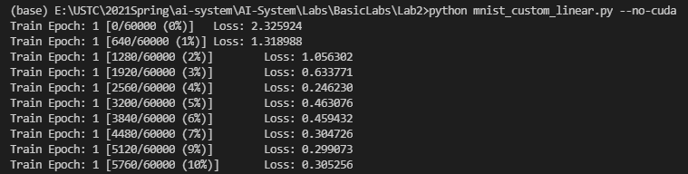

# Lab 2 - 定制一个新的张量运算

## 实验目的

1.	理解DNN框架中的张量算子的原理
2.	基于不同方法实现新的张量运算，并比较性能差异

## 实验环境

* PyTorch==1.5.0

## 实验原理

1. 深度神经网络中的张量运算原理
2. PyTorch中基于Function和Module构造张量的方法
3. 通过C++扩展编写Python函数模块

## 实验内容

### 具体步骤

1. 在MNIST的模型样例中，选择线性层（Linear）张量运算进行定制化实现

2. 理解PyTorch构造张量运算的基本单位：Function和Module

   Pytorch的核心思想是计算流图，而一个 Function 就表示计算流图中的一个计算节点类：给定输入计算输出，即对于每个 Function 子类都要实现一个 forward() 方法

   而与一般的“函数”不同的是，由于训练时要频繁的通过反向传播计算梯度，Pytorch要求每个计算节点通过 backward() 给出，在给定对输出的梯度的情况下，如何计算对输入的梯度，即

   

   这也是为什么 backward() 的输入数目等于 forward() 的输出数目，backward() 的输出数目等于 forward() 的输入数目

   Function 只关注如何进行“计算”（包括正向和反向），而 Module 主要用于实例化 Function，指定 Function 的输入，可以理解为计算流图中某个位置的节点

3. 基于Function和Module的Python API重新实现Linear张量运算

   1. 修改MNIST样例代码

   2. 基于PyTorch  Module编写自定义的Linear 类模块

   3. 基于PyTorch Function实现前向计算和反向传播函数

      ```python
      class myLinearFunction(torch.autograd.Function):
          @staticmethod
          def forward(ctx, input, weight):
              ctx.save_for_backward(input, weight)
              output = input.mm(weight.t())
              return output
              
          @staticmethod
          def backward(ctx, grad_output):
              input, weight = ctx.saved_tensors
              grad_input = grad_weight = None
              grad_input = grad_output.mm(weight)
              grad_weight = grad_output.t().mm(input)
              return grad_input, grad_weight
      ```

      这里没有考虑偏移，对于 forward() 只需将输入张量与参数相乘，同时根据矩阵求导的方法可知 backward() ，即
      $$
      Y=AX => \frac{\partial L}{\partial X}=A^T * \frac{\partial L}{\partial Y}
      $$
      

   4. 使用自定义Linear替换网络中nn.Linear() 类

   5. 运行程序，验证网络正确性

      

4. 理解PyTorch张量运算在后端执行原理

   

5. 实现C++版本的定制化张量运算

   1. 基于C++，实现自定义Linear层前向计算和反向传播函数，并绑定为Python模型

      这里采用事先编译的C++拓展方式，在子目录中添加`setup.py`，声明文件名和模块名

      ```python
      from setuptools import setup, Extension
      from torch.utils import cpp_extension
      
      setup(name='mylinear_cpp',
            ext_modules=[cpp_extension.CppExtension('mylinear_cpp', ['mylinear.cpp'])],
            cmdclass={'build_ext': cpp_extension.BuildExtension})
      ```

      添加`mylinear.cpp`，编写要用到的函数（这里是 forward 和 backward 函数），并使用pybind11将C++中的函数与Pytorch中要调用的 forward() 和 backward() 方法绑定

      ```c++
      #include <torch/extension.h>
      
      #include <iostream>
      #include <vector>
      
      std::vector<torch::Tensor> mylinear_forward(
          torch::Tensor input,
          torch::Tensor weights) 
      {
          auto output = torch::mm(input, weights.transpose(0, 1));
          
          return {output};
      }
      
      std::vector<torch::Tensor> mylinear_backward(
          torch::Tensor grad_output,
          torch::Tensor input,
          torch::Tensor weights
          ) 
      {
          auto grad_input = torch::mm(grad_output, weights);
          auto grad_weights = torch::mm(grad_output.transpose(0, 1), input);
      
          return {grad_input, grad_weights};
      }
      
      PYBIND11_MODULE(TORCH_EXTENSION_NAME, m) {
        m.def("forward", &mylinear_forward, "myLinear forward");
        m.def("backward", &mylinear_backward, "myLinear backward");
      }
      ```

   2. 将代码生成python的C++扩展

      使用`python setup.py install`生成相应模块

      

   3. 使用基于C++的函数扩展，实现自定义Linear类模块的前向计算和反向传播函数

      直接import定义的模块`mylinear_cpp`，并且在定义Function时，使用`mylinear_cpp`中的方法

      ```python
      import mylinear_cpp 
      
      class myLinearFunction(torch.autograd.Function):
          # Note that both forward and backward are @staticmethods
          @staticmethod
          def forward(ctx, input, weight):
              ctx.save_for_backward(input, weight)
              output = mylinear_cpp.forward(input, weight)
              return output[0]
              
          @staticmethod
          def backward(ctx, grad_output):
              input, weight = ctx.saved_tensors
              grad_input, grad_weight = mylinear_cpp.backward(grad_output, input, weight)
              return grad_input, grad_weight
      ```

   4. 运行程序，验证网络正确性

      

6. 使用profiler比较网络性能：比较原有张量运算和两种自定义张量运算的性能

   见实验结果中的图，可以发现原有张量运算使用的是`t`和`addmm`，两种自定义使用的是`myLinearFunction, t, mm`

   各种运算的性能差别不大，而且我反复测试后发现C++拓展的性能基本上不如Pytorch拓展的性能，也可见Pytorch本身的优化已经非常出色了


## 实验报告

### 实验环境

||||
|--------|--------------|--------------------------|
|硬件环境|CPU（vCPU数目）|Intel(R) Core(TM) i5-7300HQ CPU @ 2.50GHz|
||GPU(型号，数目)|NVIDIA GeForce GTX 1050 Ti|
|软件环境|OS版本|Windows 10|
||深度学习框架<br />python包名称及版本|Pytorch 1.5.0 with Python 3.7.1|
||CUDA版本|10.1|

### 实验结果

||（均未开启CUDA）|
|---------------|---------------------------|
| 实现方式（Linear层为例）| 性能评测 |
|PyTorch原有张量运算| |
|基于Python API的定制化张量运算||
|基于C++的定制化张量运算||


## 参考资料

* EXTENDING PYTORCH: https://pytorch.org/docs/master/notes/extending.html