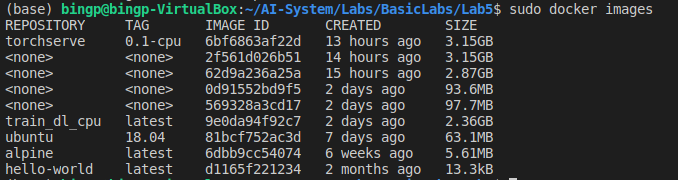
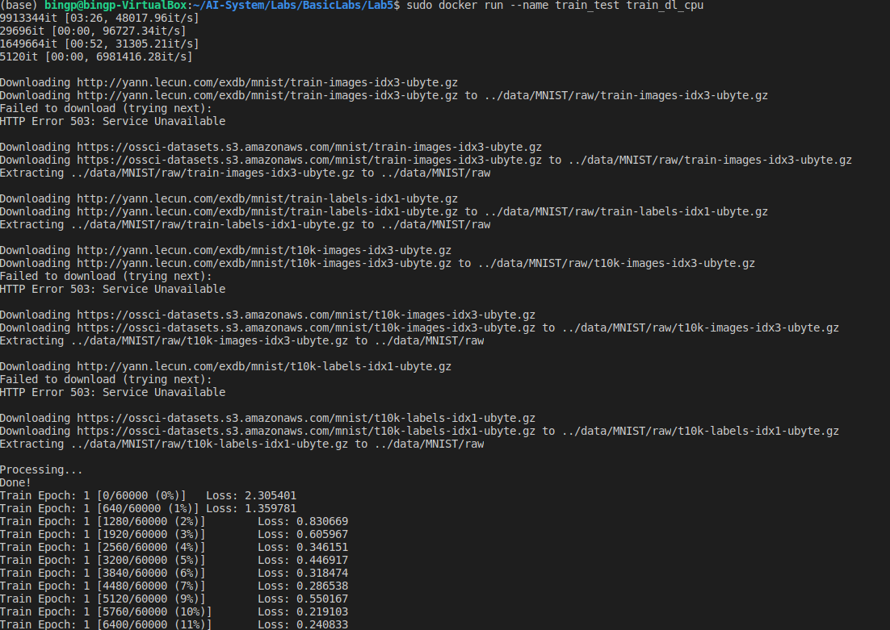
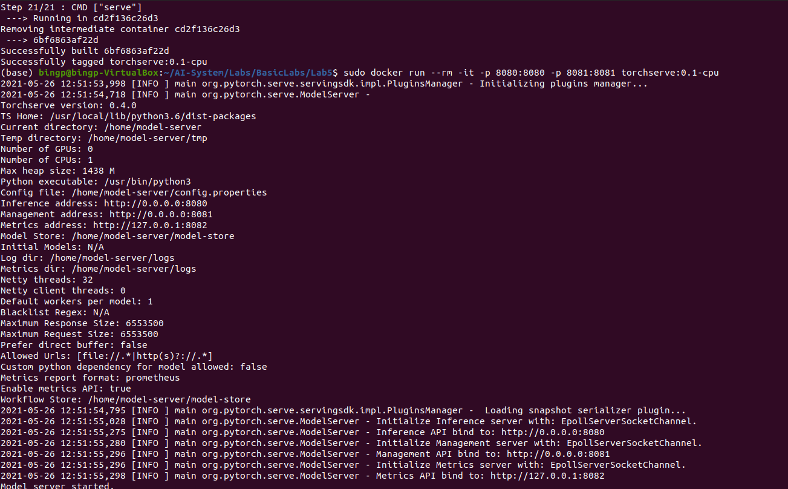
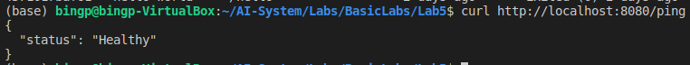
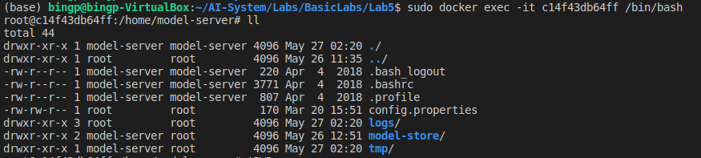
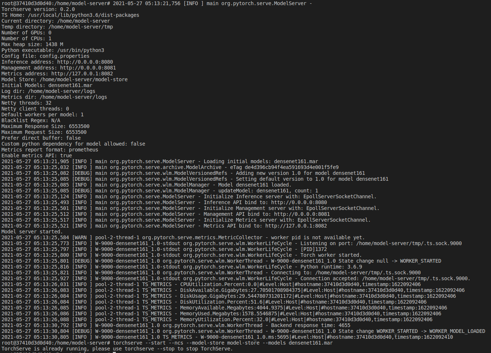
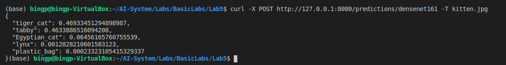

# Lab 5 - 配置Container进行云上训练或推理

## 实验目的

1. 理解Container机制
2. 使用Container进行自定义深度学习训练或推理

## 实验环境

* PyTorch==1.5.0
* Docker Engine

## 实验原理

计算集群调度管理，与云上训练和推理的基本知识

## 实验内容

### 具体步骤

1.	安装最新版Docker Engine，完成实验环境设置

2.	运行一个alpine容器

    1. Pull alpine docker image
    2. 运行docker container，并列出当前目录内容
    3. 使用交互式方式启动docker container，并查看当前目录内容
    4. 退出容器

3.	Docker部署PyTorch训练程序，并完成模型训练

    1. 编写Dockerfile：使用含有cuda10.1的基础镜像，编写能够运行MNIST样例的Dockerfile
    2. Build镜像
    3. 使用该镜像启动容器，并完成训练过程
    4. 获取训练结果

4.	Docker部署PyTorch推理程序，并完成一个推理服务

    1. 克隆TorchServe源码
    2. 编写基于GPU的TorchServe镜像
    3. 使用TorchServe镜像启动一个容器
    4. 使用TorchServe进行模型推理
    5. 返回推理结果，验证正确性


## 实验报告

### 实验环境

||||
|--------|--------------|--------------------------|
|硬件环境|CPU（vCPU数目）|Intel(R) Core(TM) i5-7300HQ CPU @ 2.50GHz|
||GPU(型号，数目)|N/A|
|软件环境|OS版本|Ubuntu 20.04 LTS on VisualBox|
||深度学习框架<br />python包名称及版本|Pytorch 1.5.0 with Python 3.8.5|
||CUDA版本|N/A|

### 实验结果

1.	使用Docker部署PyTorch MNIST 训练程序，以交互的方式在容器中运行训练程序。提交以下内容：

    1. 创建模型训练镜像，并提交Dockerfile
    
       由于该镜像需要通过conda下载pytorch，为了加快速度，我修改了一下Dockerfile以加快速度
    
       ```dockerfile
       # 继承自哪个基础镜像
       
       FROM ubuntu:18.04
       
       # 创建镜像中的文件夹，用于存储新的代码或文件
       
       RUN mkdir -p /src/app
       
       
       # WORKDIR指令设置Dockerfile中的任何RUN，CMD，ENTRPOINT，COPY和ADD指令的工作目录
       
       WORKDIR /src/app
       
       
       # 拷贝本地文件到Docker镜像中相应目录
       
       COPY pytorch_mnist_basic.py /src/app
       
       
       # 需要安装的依赖 
       
       
       
       RUN apt-get update && apt-get install wget bzip2 -y
       
       RUN wget https://repo.continuum.io/miniconda/Miniconda3-latest-Linux-x86_64.sh -O miniconda.sh
       
       RUN bash miniconda.sh -b -p /opt/conda
       
       ENV PATH /opt/conda/bin:$PATH
       
       
       RUN conda config --set show_channel_urls yes
       
       RUN conda config --add channels https://mirrors.tuna.tsinghua.edu.cn/anaconda/cloud/pytorch/  
       
       
       RUN conda install pytorch torchvision cpuonly -c pytorch
       
       
       
       # 容器启动命令
       
       CMD [ "python", "pytorch_mnist_basic.py" ]
       
       ```
    
    2. 提交镜像构建成功的日志
    
       
    
       \<none\>是几次由于网络问题失败的构建
    
    3. 启动训练程序，提交训练成功日志（例如：MNIST训练日志截图）
    
       


2.	使用Docker部署MNIST模型的推理服务，并进行推理。提交以下内容：
    1. 创建模型推理镜像，并提交Dockerfile
    
    2. 启动容器，访问TorchServe API，提交返回结果日志
    
       
    
       
    
    3. 使用训练好的模型，启动TorchServe，在新的终端中，使用一张图片进行推理服务。提交图片和推理程序返回结果截图。
    
       做到这里，启动TorchServe后一直报错
    
       ```
       W-9000-densenet161_1.0 org.pytorch.serve.wlm.BatchAggregator - Load model failed: densenet161, error: Worker died.
       ```
    
       并且无法完成推理，最终我参照了这个issue [No module named 'image_classifier' when following steps given in densenet161 example · Issue #966 · pytorch/serve (github.com)](https://github.com/pytorch/serve/issues/966) ，使用了github上serve库中图像分类的模型，并重新安装了相应依赖
       
       ```bash
       torch-model-archiver --model-name densenet161 --version 1.0 --model-file /home/image_classifier/densenet_161/model.py --serialized-file /home/model-server/model-store/densenet161-8d451a50.pth --handler image_classifier --extra-files /home/image_classifier/index_to_name.json --export-path /home/model-server/model-store --force
       /home/model-server/model-store/densenet161.mar .root@37410d3d0d40:/home# WARNING - Overwriting /home/model-serve
       
       apt-get install python3 python3-dev python3-pip openjdk-11-jre-headless git wget curl -y
       
       python3 -m pip install torch torchvision torch-model-archiver torchserve==0.2.0
       ```
       
       最终serve成功运行并完成了推理
       
       
       
       
       
       > 如果助教/老师还在维护该项目的话可以加一点说明，这个地方还蛮坑的（


## 参考代码

本次实验基本教程:

* [1. 实验环境设置](./setup.md)
* [2. 运行你的第一个容器 - 内容，步骤，作业](./alpine.md)
* [3. Docker部署PyTorch训练程序 - 内容，步骤，作业](./train.md)
* [4. Docker部署PyTorch推理程序 - 内容，步骤，作业](./inference.md)
* [5. 进阶学习](./extend.md)

## 参考资料

* [Docker Tutorials and Labs](https://github.com/docker/labs/)
* [A comprehensive tutorial on getting started with Docker!](https://github.com/prakhar1989/docker-curriculum)
* [Please-Contain-Yourself](https://github.com/dylanlrrb/Please-Contain-Yourself)
* [Create TorchServe docker image](https://github.com/pytorch/serve/tree/master/docker)


